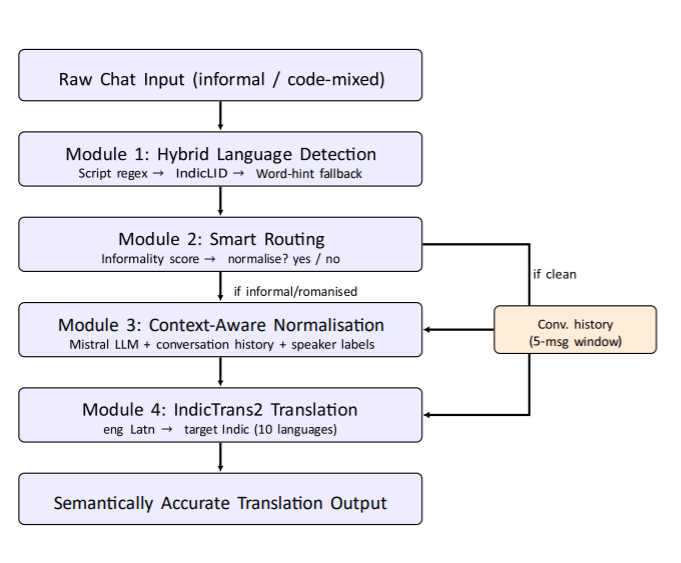

# Multilingual Machine Translation — Unification of Indian Languages

A four-module intelligent pipeline that translates informal, code-mixed, and slang-heavy Indian chat messages across 10 Indian languages. Built on top of IndicTrans2 with a Mistral LLM normalization layer and deployed as a real-time Spring Boot + React chat application.

---

## Team
| Name | Registration Number |
|------|-------------------|
| Shravan Taleki | 2022BCSE07AED792 |
| Rakshith | 2022BCSE07AED793 |
| Mohammed Haaroon | 2022BCSE07AED802 |
| Sujan Prakash P | 2022BCSE07AED815 |

**Guided by:** Dr. M. Selvam

---

## Problem Statement

India has 22 official languages and hundreds of dialects. Real-world chat messages are informal, code-mixed, and slang-heavy — a domain where existing translation systems completely fail. Messages like "bhai server down hai kya?" or "app open panna crash aaguthu" are passed through untranslated or produce meaningless literal output by systems like Google Translate and IndicTrans2 Raw.

---

## Proposed Solution

A four-module pipeline that prepares informal input before translation:

- **Module 1 — Hybrid Language Detector:** Three-stage detection using Unicode script matching, IndicLID neural identifier, and romanized word-hint fallback
- **Module 2 — Smart Routing:** Scores every message for informality using 5 signals — skips LLM entirely for clean messages, saving 20.7% of API calls
- **Module 3 — Mistral Normalization:** Resolves slang, idioms, abbreviations, and code-mixed expressions into clean English using Mistral-7B
- **Module 4 — IndicTrans2 Translation:** Translates normalized English into 10 Indian languages using ai4bharat/indictrans2-en-indic-1B

---

## Supported Languages

Hindi, Kannada, Tamil, Telugu, Malayalam, Marathi, Bengali, Gujarati, Punjabi, Odia

---

## Results

Evaluated on a 199-sentence benchmark across 6 categories:

| Category | Count | Our Pipeline | IndicTrans2 Raw | Google Translate |
|----------|-------|-------------|-----------------|------------------|
| Hinglish (romanized) | 29 | **0.9558** | 0.9427 | 0.6877 |
| Kanglish (romanized) | 12 | **0.9549** | 0.9548 | 0.7603 |
| Tanglish (romanized) | 9 | **0.9603** | 0.9586 | 0.7837 |
| Native Script | 89 | 0.9499 | 0.8784 | **0.9714** |
| Informal English | 45 | **0.9459** | 0.9295 | 0.7681 |
| Idioms & Slang | 25 | **0.9499** | 0.9404 | 0.9415 |
| **OVERALL** | **199** | **0.9506** | 0.9136 | 0.8645 |

Metric: BERTScore F1

---

## Technology Stack

| Layer | Technology |
|-------|-----------|
| Frontend | React.js, WebSockets |
| Backend | Spring Boot, FastAPI |
| AI/ML Models | IndicTrans2-1B, Mistral-7B, IndicLID |
| Tools | PyTorch, HuggingFace Transformers, IndicTransToolkit |
| Infrastructure | Google Colab, ngrok, MySQL |

---

## Project Structure
```
Multilingual-Machine-translation/
│
├── src/
│   ├── backend/          ← Spring Boot application
│   ├── frontend/         ← React application
│   └── translator/       ← Jupyter notebook (translation pipeline)
│
├── docs/                 ← Research paper
├── README.md
├── requirements.txt
├── architecture.png
├── demo_video_link.txt
└── setup_instructions.md
```

---

## Architecture



---

## Demo

See `demo_video_link.txt` for the demo video link.

---

## Research Paper

Available in the `docs/` folder.

---

## Setup Instructions

See `setup_instructions.md` for detailed setup steps.
